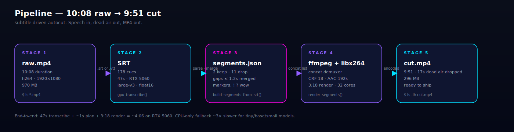
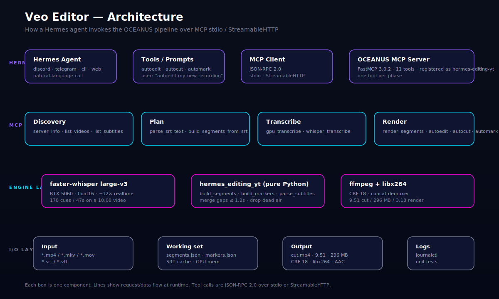
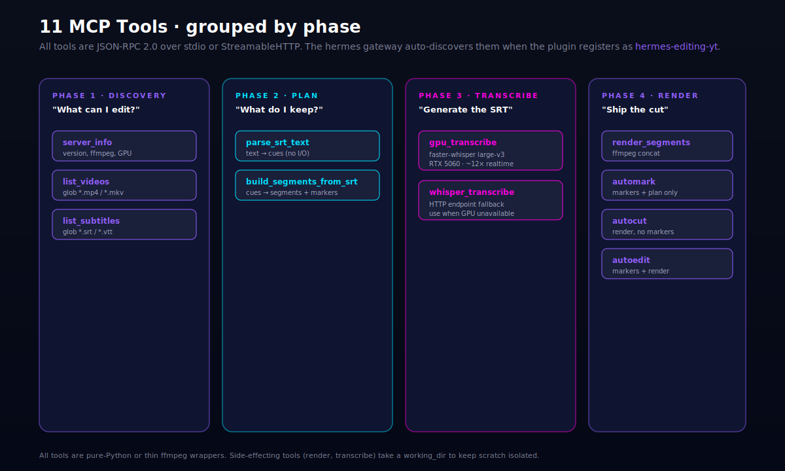

<div align="center">

# hermes-editing-yt

### Subtitle-driven auto video editor for the Hermes Editing pipeline.

**One MCP call. Local GPU. Free forever. No API keys.**

[](LICENSE)
[](https://python.org)
[](https://github.com/jlowin/fastmcp)
[](https://developer.nvidia.com)
[](https://hermes-agent.nousresearch.com)

[**Website**](https://capslockb.github.io/hermes-editing-yt) · [**Install**](#-install) · [**The 11 MCP tools**](#-the-11-mcp-tools) · [**Architecture**](#-architecture) · [**Changelog**](CHANGELOG.md)

</div>

---

## Why hermes-editing-yt

Drop the dead air, keep the takes. hermes-editing-yt reads your SRT (or transcribes one with the local GPU), finds the spoken segments, drops gaps longer than 1.2s, and renders a CRF-18 MP4 — all in a single MCP call from any Hermes agent.

On a typical 10-minute recording you can expect **5–15% shorter** output (the bigger the pauses, the more it cuts). Tunable via `HERMES_EDITING_YT_MERGE_GAP`; the default preserves natural breath beats.

```
  raw.mp4 (10:00)  ──►  SRT (or local GPU large-v3)  ──►  segments  ──►  ffmpeg+libx264
                       (~150–200 cues / 40–60s on RTX 5060)               (3–5 min render)
                                                                                │
                                                                                ▼
                                                       cut.mp4 (≈8:30–9:30, CRF 18, AAC 192k)
```

> The "9:51" figure from earlier releases came from a recording with almost no silence (gameplay commentary, 17s of dead air total). A real spoken-word vlog with 30–60s of pauses will land closer to 8:00–8:30. Adjust `HERMES_EDITING_YT_MERGE_GAP` for more or less aggressive trimming.



---

## ✨ Features

| Capability | What it does |
|---|---|
| **GPU transcription** | `faster-whisper` `large-v3` on RTX 5060, float16. ~12× realtime. `cublas v12` shim baked in for sm_120. |
| **Subtitle-driven cut** | Loads an SRT (or transcribes one), finds speech segments, merges gaps ≤1.2s, drops everything else. |
| **Highlight markers** | Auto-tags "boss", "spawn", "rare", "wait", "wow", "let's go", `!`/`?` lines as suggestion markers. |
| **3 modes** | `automark` (markers + plan only, no render) · `autocut` (render, no markers) · `autoedit` (both). |
| **FastMCP 3.0.2 server** | 11 tools over stdio + StreamableHTTP. Registers as `hermes-editing-yt` in Hermes. |
| **Oneshot installer** | `curl ... \| bash` (Linux/macOS) or `iwr ... \| iex` (Windows). TUI prompts, unit-test gate, auto-register. |
| **No API keys** | Local GPU. Optional HTTP Whisper endpoint if you already run one. |

---

## 🏗 Architecture

hermes-editing-yt runs as a **FastMCP plugin** inside the Hermes agent swarm. The agent invokes one of 11 tools over JSON-RPC 2.0 (stdio or StreamableHTTP). The plugin orchestrates Whisper, ffmpeg, and a pure-Python cut planner.



Read the full design in [`docs/architecture.md`](docs/architecture.md).

### The 11 MCP tools

The plugin registers as `hermes-editing-yt` in Hermes and exposes 11 tools grouped by phase:



| Phase | Tools |
|---|---|
| **Discovery** | `server_info`, `list_videos`, `list_subtitles` |
| **Plan** | `parse_srt_text`, `build_segments_from_srt` |
| **Transcribe** | `gpu_transcribe` (local GPU), `whisper_transcribe` (HTTP endpoint) |
| **Render** | `render_segments`, `automark`, `autocut`, `autoedit` |

---

## 📸 Gallery

Drop-in visuals for readme banners, social cards, and docs:

| | |
|---|---|
|  |  |
| **GPU render** — RTX 5060 with cublas v12 shim | **3D pipeline** — raw → SRT → segments → render |
|  |  |
| **Hero workstation** — 3D isometric editing suite | **App icon** — ed-glyph mark on obsidian, cyan rim |

All four are generated for this release under MIT.

---

## 🚀 Install

### One-shot (Windows)
```powershell
iwr -useb https://raw.githubusercontent.com/Capslockb/hermes-editing-yt/main/installer/install.ps1 | iex
```

### One-shot (Linux / macOS)
```bash
curl -sSL https://raw.githubusercontent.com/Capslockb/hermes-editing-yt/main/installer/install.sh | bash
```

### TUI installer (interactive)
```bash
git clone https://github.com/Capslockb/hermes-editing-yt.git
cd hermes-editing-yt
python installer/install.py
```

### Non-interactive (CI / scripted)
```bash
git clone https://github.com/Capslockb/hermes-editing-yt.git
cd hermes-editing-yt
python installer/install.py --non-interactive
```

### Uninstall
```bash
python installer/install.py --uninstall
```

---

## 🔧 Requirements

- Python 3.10+
- ffmpeg on PATH
- CUDA-capable GPU recommended (RTX 5060 verified; CPU works for `tiny`/`base`/`small` models)
- `hermes-agent` if you want auto-registration with the MCP gateway

The installer checks for all of these and tells you what's missing.

---

## 🎬 Usage

### From any Hermes chat
```
Use the hermes-editing-yt MCP tools to autocut
G:\- hermes-editing-yt\Editing\New folder\Helgstr1.mp4
with output to G:\- hermes-editing-yt\output\my-first-cut
```

### From a script
```python
import subprocess, json
result = subprocess.run(
    ["hermes", "mcp", "call", "hermes-editing-yt", "autoedit",
     "--video_path", r"G:\- hermes-editing-yt\Editing\New folder\Helgstr1.mp4",
     "--output_dir", r"G:\- hermes-editing-yt\output\my-first-cut"],
    capture_output=True, text=True
)
print(json.loads(result.stdout))
```

### Direct Python API
```python
from plugin import run_pipeline, PipelineConfig
cfg = PipelineConfig(
    video_path=Path("Helgstr1.mp4"),
    output_dir=Path("output"),
    mode="autoedit",
    transcribe_backend="faster-whisper",
    whisper_model="large-v3",
    whisper_device="cuda",
    whisper_compute_type="float16",
)
result = run_pipeline(cfg)
print(f"kept {result.kept_duration_seconds:.1f}s of {result.duration_seconds:.1f}s")
```

---

## ⚙️ Configuration (env vars)

| Var | Default | Notes |
|---|---|---|
| `HERMES_EDITING_YT_OUTPUT_DIR` | `~/hermes-editing-yt-output` | Where autocut/autoedit writes |
| `HERMES_EDITING_YT_WHISPER_URL` | _(empty)_ | External Whisper endpoint. Empty = local GPU |
| `HERMES_EDITING_YT_WHISPER_MODEL` | `large-v3` | `tiny` / `base` / `small` / `medium` / `large-v3` |
| `HERMES_EDITING_YT_WHISPER_DEVICE` | `cuda` | `cpu` if no GPU |
| `HERMES_EDITING_YT_WHISPER_COMPUTE` | `float16` | `float32` / `int8` |

---

## 🧪 Testing

```bash
pip install pytest
pytest tests/ -q                       # 35 unit tests, ~4s
python tests/test_mcp_server.py        # 11-tool MCP stdio smoke, ~6s
python scripts/run_gpu_demo.py         # full GPU autocut on the bundled demo video
```

---

## 📁 Repo layout

```
hermes-editing-yt/
├── plugin/                     # the library + MCP server (installable)
│   ├── hermes_editing_yt.py     # pure-Python pipeline (no GUI)
│   ├── mcp_server.py           # FastMCP 3.0.2 server, 11 tools
│   ├── plugin.yaml             # Hermes plugin manifest
│   ├── requirements.txt        # pip deps
│   └── __init__.py             # re-exports
├── installer/                  # the oneshot installer
│   ├── install.py              # rich TUI installer (--non-interactive / --uninstall)
│   ├── install.sh              # bash curl-pipe-bash entry
│   └── install.ps1             # PowerShell iwr|iex entry
├── skills/hermes-editing-yt/    # Hermes skill doc
│   └── SKILL.md
├── site/                       # the website (React + Three.js, GitHub Pages)
│   ├── src/                    # components, constants, 3D canvas
│   ├── public/                 # static assets, og-image
│   └── vite.config.ts          # base: /hermes-editing-yt/
├── tests/                      # 35 unit tests + 11-tool MCP smoke
├── scripts/
│   └── run_gpu_demo.py         # end-to-end demo runner
├── docs/                       # architecture, troubleshooting, diagrams
│   ├── architecture.md
│   ├── troubleshooting.md
│   ├── diagrams/               # SVG architecture, pipeline, MCP tools
│   └── media/                  # generated hero images, logo
├── .github/workflows/          # CI: lint + test
├── CHANGELOG.md
├── LICENSE                     # MIT
└── README.md
```

---

## 🌐 Website

The site is a 3D React + Three.js app, customized for hermes-editing-yt from the
MIT-licensed [sanidhyy/3d-portfolio](https://github.com/sanidhyy/3d-portfolio) template.

```bash
cd site
npm install --legacy-peer-deps
npm run dev          # preview at http://127.0.0.1:5173
npm run build        # static site → site/dist/
```

Deployed automatically to **https://capslockb.github.io/hermes-editing-yt/** on every push to `main`.

---

## 🤝 Related repos

- [`Capslockb/gemini-live-discord-bridge`](https://github.com/Capslockb/gemini-live-discord-bridge) — Discord voice bridge (Hermes plugin + oneshot TUI)
- [`Capslockb/vapi-discord-bridge`](https://github.com/Capslockb/vapi-discord-bridge) — Vapi.ai Discord bridge
- [`Capslockb/tony-stark-hand-control`](https://github.com/Capslockb/tony-stark-hand-control) — the hand-tracking project this was developed alongside of
- [`sanidhyy/3d-portfolio`](https://github.com/sanidhyy/3d-portfolio) — MIT-licensed 3D portfolio template the site is built on

---

## 📜 License

MIT — see [`LICENSE`](LICENSE). Site is a derivative of
[sanidhyy/3d-portfolio](https://github.com/sanidhyy/3d-portfolio) (MIT).
