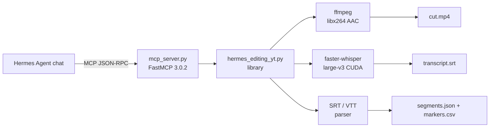

<div align="center">


# hermes-editing-yt

### Subtitle-Driven Auto Video Editor

**One MCP call. Local GPU. Free forever. No API keys.**

[](https://capslockb.github.io/hermes-editing-yt)
[](docs-site/index.html)
[](docs/quickstart.md)
[](docs/architecture.md)
[](docs/operator-helpers.md)
[](docs/release-readiness.md)
[](LICENSE)

</div>

---

## What this release is

hermes-editing-yt turns a raw `.mp4` into a cut MP4 by following the subtitles. It reads your SRT (or transcribes one with local GPU Whisper), groups nearby cues into keep-segments, marks highlights from keywords and punctuation, then renders the final cut through ffmpeg. The entire pipeline is exposed as **11 MCP tools** on a FastMCP 3.0.2 server, so any Hermes agent can drive it with one tool call. This release ships the library, MCP server, oneshot installer, tests, React/Three.js public site, and raw docs — all under MIT.

> **Tagline:** *Your videos, editable by text.*

---

## Status map

| Area | Status | Truthful scope |
|---|---|---|
| SRT / WebVTT parsing | **Working** | Pure function, 35 unit tests pass. |
| Segment + marker building | **Working** | Pure function, configurable knobs, unit tested. |
| ffmpeg render path | **Working** | Extract, cut, concat, re-encode via PATH ffmpeg. |
| Local GPU Whisper transcription | **Working** | faster-whisper large-v3 on CUDA float16 (RTX 5060 verified). |
| MCP server — 11 tools | **Working** | FastMCP 3.0.2 stdio + StreamableHTTP support. |
| Oneshot installer (TUI + non-interactive) | **Working** | Linux / macOS / Windows; unit-test gate; Hermes MCP registration. |
| Website (React + Three.js) | **Working** | Deployed to https://capslockb.github.io/hermes-editing-yt/. |
| CI lint + unit test | **Working** | GitHub Actions on push / PR. |
| HTTP Whisper backend (`whisper_transcribe`) | **Partial** | Code complete, but needs a separate Whisper server at the configured URL. |
| Standalone CLI beyond MCP | **Planned** | Backwards-compat CLI exists; first-class `python -m hermes_editing_yt` entry coming. |
| Batch / folder pipeline | **Planned** | `list_videos` exists; bulk autocut orchestrator not yet implemented. |
| GUI timeline editor | **Research** | No code yet; possible future web or desktop surface. |
| Cloud transcription | **Research** | HTTP hook is the only cloud-facing surface today. |

Status labels: **Working** = code + executable verification path; **Partial** = code exists but depends on a local service; **Planned** = roadmap with known design; **Research** = mentioned only as a future target.

---

## Architecture



ASCII runtime/dataflow:

```
raw.mp4 ──► extract_audio ──┬──► whisper_input.wav ──► faster-whisper ──► transcript.srt
                            │                            (local GPU)
                            └──► audio_only.mp3 ───────────────────────────► delivery audio

transcript.srt ──► parse_subtitles ──► build_segments ──► build_markers
                                                       │
                                                       ├──► segments.csv + markers.csv
                                                       └──► render_autocut ──► cut.mp4
```

Read the full design in [`docs/architecture.md`](docs/architecture.md).

---

## Quick start

```bash
# 1. Clone
git clone https://github.com/Capslockb/hermes-editing-yt.git
cd hermes-editing-yt

# 2. Install deps + run the gate
python3 -m pip install -r plugin/requirements.txt
python3 -m pytest tests/test_hermes_editing_yt.py -q

# 3. Register the MCP server with Hermes
python3 installer/install.py --non-interactive

# 4. Verify the server is discoverable
hermes mcp test hermes-editing-yt

# 5. First tool call from any Hermes chat
Use the hermes-editing-yt MCP tools to autocut \
/path/to/video.mp4 with output to /path/to/output/my-first-cut
```

> **Tip:** if you only want to preview cuts without paying for a render, call `build_segments_from_srt` with your existing SRT text — no ffmpeg, no GPU.

---

## Operator helpers

These are convenience utilities that make the editing pipeline friendlier inside Hermes:

| Helper | What it does | Status |
|---|---|---|
| `server_info` | Returns version, default paths, ffmpeg/Whisper health, segmentation defaults. | Working |
| `list_videos(root)` | Recursively discover `.mp4/.mkv/.mov/.avi/.m4v/.webm`. | Working |
| `list_subtitles(root)` | Recursively discover `.srt/.vtt`. | Working |
| `parse_srt_text(text)` | Pure SRT/VTT parser → JSON cues. | Working |
| `build_segments_from_srt` | Pure preview of keep-segments + markers from SRT text. | Working |
| `automark` | Audio + SRT + plan + CSVs, no render. | Working |
| `autocut` | Full pipeline including render. | Working |
| `autoedit` | Alias for full export bundle. | Working |

Read more in [`docs/operator-helpers.md`](docs/operator-helpers.md).

---

## Feature matrix

| Feature | Works? | Doc | Caveat |
|---|---|---|---|
| GPU Whisper transcription | Working | [`docs/architecture.md`](docs/architecture.md) | Requires CUDA GPU + cuBLAS 12 + ffmpeg. |
| SRT/VTT subtitle-driven cut | Working | [`docs/architecture.md`](docs/architecture.md) | Pure Python, no external deps for preview. |
| ffmpeg render to MP4 | Working | [`docs/architecture.md`](docs/architecture.md) | ffmpeg must be on PATH. |
| 3 modes (automark/autocut/autoedit) | Working | [`docs/operator-helpers.md`](docs/operator-helpers.md) | `automark` is preview-only. |
| 11 MCP tools via FastMCP 3.0.2 | Working | [`docs/mcp-tools.md`](docs/mcp-tools.md) | stdio default; StreamableHTTP with `--http PORT`. |
| One-shot installer | Working | [`docs/quickstart.md`](docs/quickstart.md) | Registers via `hermes` CLI if available. |
| React/Three.js website | Working | [`docs/architecture.md`](docs/architecture.md) | Auto-deployed from `site/` by `.github/workflows/pages.yml`. |
| HTTP Whisper backend | Partial | [`docs/mcp-tools.md`](docs/mcp-tools.md) | Needs a separate Whisper server. |
| Batch folder pipeline | Planned | [`docs/release-readiness.md`](docs/release-readiness.md) | `list_videos` is the only primitive today. |
| GUI timeline editor | Research | — | No code yet. |
| Cloud transcription | Research | — | Only the HTTP hook exists today. |

---

## Required environment

```bash
# ~/.bashrc or shell profile
export HERMES_EDITING_YT_OUTPUT_DIR="$HOME/hermes-editing-yt-output"
export HERMES_EDITING_YT_WHISPER_URL=""                    # blank = use local GPU
export HERMES_EDITING_YT_WHISPER_MODEL="large-v3"
export HERMES_EDITING_YT_WHISPER_DEVICE="cuda"             # "cpu" if no GPU
export HERMES_EDITING_YT_WHISPER_COMPUTE="float16"
export HERMES_EDITING_YT_MERGE_GAP="1.20"
```

The full reference is in [`docs/env-vars.md`](docs/env-vars.md).

---

## MCP server / StreamableHTTP endpoint

The MCP server is the primary control surface. It runs over stdio by default and can also expose a StreamableHTTP transport.

| Transport | Command | Use case |
|---|---|---|
| stdio | `python plugin/mcp_server.py` | Hermes gateway, Claude Desktop, Cursor |
| StreamableHTTP | `python plugin/mcp_server.py --http 8765` | Browser-based MCP clients |

There is no separate sidecar process; the server itself is the only runtime.

---

## What this repo does not currently ship

- **Automatic cloud transcription.** Only local GPU Whisper and a manual HTTP endpoint are included today.
- **Visual scene detection.** The cut logic is subtitle-driven; it does not read video frames.
- **A standalone GUI timeline editor.** The site is marketing + docs only; no drag-and-drop timeline.
- **Batch/folder orchestration.** `list_videos` and `list_subtitles` exist, but a multi-file batch runner is not implemented.
- **Hermes Editing YouTube upload.** Rendering is local; upload to YouTube is out of scope.
- **Multi-user / SaaS backend.** This is a single-user, local-GPU tool.

---

## Release verification checklist

Run these commands to prove the release works:

```bash
# 1. Static syntax
python3 -m py_compile plugin/*.py scripts/*.py

# 2. Pure unit tests
python3 -m pytest tests/test_hermes_editing_yt.py -q

# 3. MCP server smoke (11 tools)
python3 tests/test_mcp_server.py

# 4. Installer dry-run checks
python3 installer/install.py --non-interactive --skip-deps

# 5. Verify site builds
npm --prefix site install --legacy-peer-deps
npm --prefix site run build

# 6. Build generated docs site
python3 scripts/build_docs_site.py
```

Then in any Hermes chat:

```text
Call hermes-editing-yt server_info
```

You should see version `1.0.0`, `ffmpeg_available: true`, and the 11-tool manifest.

---

## Documentation

- [`docs/README.md`](docs/README.md) — raw docs index
- [`docs/quickstart.md`](docs/quickstart.md) — clone → install → first command → verify
- [`docs/architecture.md`](docs/architecture.md) — system map, pipeline, integration boundaries
- [`docs/mcp-tools.md`](docs/mcp-tools.md) — 11-tool reference
- [`docs/operator-helpers.md`](docs/operator-helpers.md) — convenience tools and examples
- [`docs/env-vars.md`](docs/env-vars.md) — exhaustive env var reference
- [`docs/troubleshooting.md`](docs/troubleshooting.md) — common failures
- [`docs/release-readiness.md`](docs/release-readiness.md) — status legend, truth table, release blockers
- [`docs-site/index.html`](docs-site/index.html) — generated static docs site landing

The rich public website lives in [`site/`](site/) and deploys separately to https://capslockb.github.io/hermes-editing-yt/.

---

## License

MIT — see [`LICENSE`](LICENSE). The website is a derivative of [sanidhyy/3d-portfolio](https://github.com/sanidhyy/3d-portfolio) (MIT).
