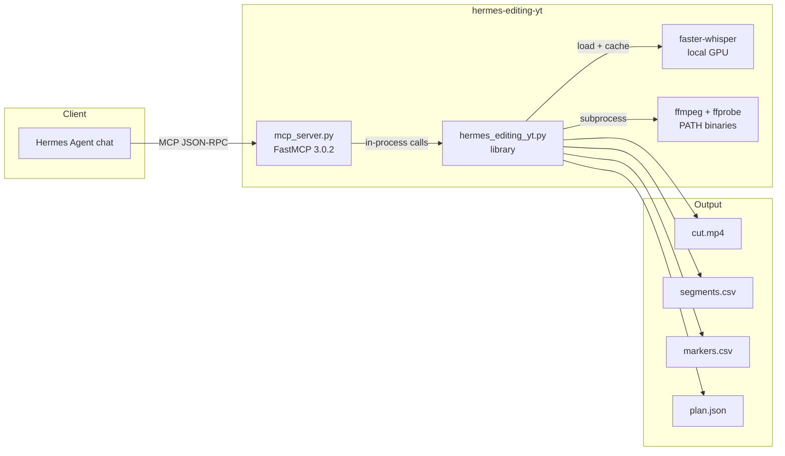

# Architecture

hermes-editing-yt is a **two-layer** system:

1. **Library** (`plugin/hermes_editing_yt.py`) — pure-Python pipeline engine. No GUI, minimal I/O (files only). Can be imported from any Python script.
2. **MCP server** (`plugin/mcp_server.py`) — FastMCP 3.0.2 server that wraps the library and exposes 11 tools over stdio or StreamableHTTP.

> Visual reference: see [`diagrams/architecture.svg`](diagrams/architecture.svg), [`diagrams/pipeline.svg`](diagrams/pipeline.svg), and [`diagrams/mcp-tools.svg`](diagrams/mcp-tools.svg).

## System map



## Audio / runtime dataflow

```
raw.mp4 ──┬──► extract_audio ──► whisper_input.wav ──► faster-whisper ──► transcript.srt
          │                                                (local GPU)
          └──► audio_only.mp3 ───────────────────────────────────────────► delivery audio

transcript.srt ──► parse_subtitles ──► build_segments ──► build_markers
                                                    │
                                                    ├──► segments.csv
                                                    ├──► markers.csv
                                                    └──► render_autocut ──► cut.mp4
```

A machine-readable version of this diagram is at [`diagrams/runtime.txt`](diagrams/runtime.txt).

## Pipeline (mode: `autoedit`)

1. **Pick the SRT** — user passes `srt_path`, auto-detect an existing SRT next to the video, or transcribe from scratch.
2. **Transcribe (if needed)** — either local GPU (`faster-whisper` large-v3 on CUDA float16) or the configured HTTP Whisper endpoint. Output is an SRT file.
3. **Parse** — `parse_subtitles` → list of `Cue` dataclasses.
4. **Build segments** — `build_segments` finds runs of cues whose gaps are ≤ 1.2 s, adds 300 ms lead-in and 450 ms tail, drops any segment shorter than 850 ms.
5. **Build markers** — `build_markers` produces:
   - `cut` markers at each segment boundary
   - `suggestion` markers for highlight keywords (`boss`, `spawn`, `rare`, `wait`, `wow`, `let's go`, etc.) or lines ending in `!` / `?`
6. **Render** — `render_autocut` extracts audio, cuts each segment, concatenates with the concat demuxer, then re-encodes to libx264 CRF 18 / AAC 192k.
7. **Write plan** — `run_pipeline` writes a JSON plan with all of the above.

## GPU transcription

`faster-whisper` is a CTranslate2-based Whisper reimplementation that is much faster than the reference implementation on CUDA. The library adds a small shim, `_ensure_cublas12_on_path()`, that registers the `nvidia-cublas-cu12` site-packages directory before `ctranslate2` is imported. This works around the `cublas64_12.dll is not found or cannot be loaded` error that occurs when `torch 2.12+cu130` (which ships cublas v13) is the only CUDA runtime on the box.

If CUDA init fails, the server falls back to CPU float32 and reports it in `server_info` and the tool result.

## Threading model

- The MCP server is **single-threaded stdio** by default. Each tool call is processed synchronously.
- `ffmpeg` calls run as **subprocesses** and block the server for the duration of the command.
- `faster-whisper` model objects are **cached at module level** by `(model, device, compute_type)`. Subsequent calls skip the multi-second model load.
- StreamableHTTP transport (`--http PORT`) uses FastMCP's built-in HTTP server and follows the same synchronous tool semantics.

## Lifecycle

1. **Install** — clone, install deps, run the unit-test gate.
2. **Register** — `python3 installer/install.py` writes the MCP server into the Hermes config.
3. **Start** — Hermes spawns the server as a child process over stdio.
4. **Initialize** — `server_info` returns health/version/config snapshot.
5. **Run** — agent calls tools; model cache warms up on first GPU transcription.
6. **Stop** — Hermes closes the stdio pipe; the process exits cleanly.

## Key files

| File | Role |
|---|---|
| `plugin/hermes_editing_yt.py` | Pure-Python library: parse, segment, marker, render, transcribe, pipeline. |
| `plugin/mcp_server.py` | FastMCP 3.0.2 server with 11 tools. |
| `plugin/plugin.yaml` | Hermes plugin manifest: name, version, tools, optional env vars. |
| `plugin/requirements.txt` | Runtime Python dependencies. |
| `installer/install.py` | Rich TUI installer with non-interactive and uninstall modes. |
| `tests/test_hermes_editing_yt.py` | 35 pure unit tests. |
| `tests/test_mcp_server.py` | 11-tool MCP stdio smoke test. |
| `site/` | React/Three.js public website (Next.js export). |
| `docs/` | Raw Markdown documentation (this tree). |

## Key env vars

| Var | Default | Purpose |
|---|---|---|
| `HERMES_EDITING_YT_OUTPUT_DIR` | `~/hermes-editing-yt-output` | Default render output root. |
| `HERMES_EDITING_YT_WHISPER_URL` | `http://127.0.0.1:51746/transcribe` | External Whisper HTTP endpoint. Empty string forces local GPU. |
| `HERMES_EDITING_YT_WHISPER_MODEL` | `large-v3` | faster-whisper model name. |
| `HERMES_EDITING_YT_WHISPER_DEVICE` | `cuda` | `cuda` or `cpu`. |
| `HERMES_EDITING_YT_WHISPER_COMPUTE` | `float16` | `float16`, `float32`, `int8`, etc. |
| `HERMES_EDITING_YT_MERGE_GAP` | `1.20` | Seconds — drop gaps longer than this between speech cues. |

See the full reference in [`env-vars.md`](env-vars.md).

## Integration boundaries

- **Hermes Agent** talks to the server over stdio via the MCP protocol. No Hermes-specific code lives in the library.
- **ffmpeg / ffprobe** are external PATH binaries. The server shells out to them; they are not Python dependencies.
- **faster-whisper / CTranslate2** are Python dependencies. The library ships a DLL-path shim for Windows cuBLAS v12 but does not bundle CUDA.
- **HTTP Whisper endpoint** is optional and out of scope. The tool `whisper_transcribe` posts to a user-provided URL and expects a specific JSON shape.
- **React website** is a separate Next.js app in `site/`. It deploys to GitHub Pages and does not depend on the Python runtime.

## Modes

| Mode | Markers | Segments | Render |
|---|---|---|---|
| `automark` | yes | yes | **no** |
| `autocut` | no | yes | yes |
| `autoedit` | yes | yes | yes |

`automark` is for previewing cuts (cheap, no ffmpeg render) and for importing markers into Premiere / DaVinci / OBS. The CSV output uses `HH:MM:SS.mmm` start/end, marker type, and cue text.

## Performance

Recorded on the developer's RTX 5060 (8 GB, sm_120) for a 10:08 1080p MP4:

| Step | Time | Notes |
|---|---|---|
| Audio extract | ~1.2 s | ffmpeg 44.1 kHz MP3 + 16 kHz WAV |
| Whisper large-v3 float16 | ~47 s | ~12.8× realtime |
| Build segments + markers | <0.1 s | pure Python |
| Cut + concat + re-encode | ~3:18 | libx264 CRF 18 |

The re-encode dominates. For faster renders, raise CRF (`23` or `28`) or use `-preset veryfast`. For NVIDIA hardware encode, swap `libx264` for `h264_nvenc` (loss of CRF fine-tuning).
