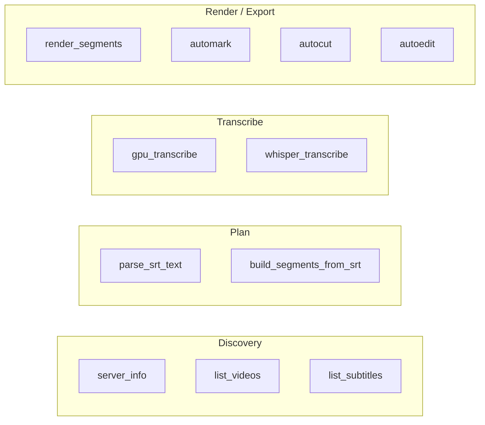

# MCP tools reference

The hermes-editing-yt MCP server registers **11 tools** under the name `hermes-editing-yt`. The default transport is stdio; a StreamableHTTP transport is available for browser-based clients.

> Visual grouping: see [`diagrams/mcp-tools.svg`](diagrams/mcp-tools.svg) and the ASCII version at [`diagrams/mcp-surface.txt`](diagrams/mcp-surface.txt).

## Tool surface



| Tool | Phase | Pure? | Status | Purpose |
|---|---|---|---|---|
| `server_info` | Discovery | yes | Working | Health/version snapshot, default paths, ffmpeg/Whisper health, env overrides. |
| `list_videos(root)` | Discovery | no | Working | Recursively list video files under `root`. |
| `list_subtitles(root)` | Discovery | no | Working | Recursively list `.srt/.vtt` files under `root`. |
| `parse_srt_text(text)` | Plan | yes | Working | Parse SRT or WebVTT text into JSON cues. |
| `build_segments_from_srt(...)` | Plan | yes | Working | Preview keep-segments + markers from SRT text + known duration. |
| `gpu_transcribe(...)` | Transcribe | no | Working | Transcribe a 16 kHz mono WAV to SRT using local faster-whisper. |
| `whisper_transcribe(...)` | Transcribe | no | Partial | POST a WAV to a local Whisper HTTP server. Needs a separate server. |
| `render_segments(...)` | Render | no | Working | Render a JSON list of `{start,end}` segments into a single MP4. |
| `automark(...)` | Export | no | Working | Audio + SRT + plan + CSVs; no render. |
| `autocut(...)` | Export | no | Working | `automark` + render MP4. |
| `autoedit(...)` | Export | no | Working | Same as `autocut` (full export bundle). |

## Transports

### stdio (default)

Used by the Hermes gateway, Claude Desktop, Cursor, etc.

```bash
python plugin/mcp_server.py
```

### StreamableHTTP

Useful for browser-based MCP clients.

```bash
python plugin/mcp_server.py --http 8765
```

The server listens on `127.0.0.1:8765` and speaks the MCP StreamableHTTP protocol.

## Tool details

### `server_info()`

Returns a JSON snapshot including `server`, `version`, `fastmcp`, default output/raw dirs, Whisper URL, ffmpeg availability, video/subtitle extensions, highlight keywords, segmentation defaults, render defaults, and env overrides.

### `list_videos(root: str)`

Returns JSON: `{root, count, files:[{path, name, size_mb, mtime}]}`.

### `list_subtitles(root: str)`

Returns JSON: `{root, count, files:[{path, name, size_bytes}]}`.

### `parse_srt_text(text: str)`

Returns JSON: `{count, cues:[{index, start, end, text}]}`.

### `build_segments_from_srt(text, duration_seconds, lead_in, tail_out, merge_gap, min_segment)`

Returns JSON: `{duration_seconds, cue_count, segment_count, marker_count, kept_duration_seconds, segments[], markers[]}`.

### `gpu_transcribe(wav_path, output_srt_path, model, device, compute_type, language, beam_size)`

Transcribe a 16 kHz mono WAV to SRT using local faster-whisper. The model is cached per `(model, device, compute_type)` for the lifetime of the server.

### `whisper_transcribe(wav_path, output_srt_path, url)`

POST the WAV to a Whisper HTTP endpoint. `url` defaults to `HERMES_EDITING_YT_WHISPER_URL`. Returns `{srt_path, byte_count, server_url}` or an `error` object if the server is unreachable.

### `render_segments(video_path, output_mp4_path, segments_json, video_codec, preset, crf, audio_codec, audio_bitrate)`

Render a JSON array of `{start, end}` segments into a single MP4.

### `automark / autocut / autoedit`

These are the full pipeline tools. Shared arguments:

- `video_path`, `output_dir`
- `srt_path` (optional)
- `whisper_url`, `transcribe_backend` (`faster-whisper`, `http`, `none`)
- `whisper_model`, `whisper_device`, `whisper_compute_type`, `whisper_language`, `whisper_beam_size`
- `lead_in`, `tail_out`, `merge_gap`, `min_segment`

`automark` returns the plan + CSVs and does **not** render. `autocut` and `autoedit` render the cut MP4.

## Example Hermes chat session

```text
User: Use hermes-editing-yt to autocut
       /home/caps/videos/Helgstr1.mp4
       to /home/caps/output/my-first-cut
       using large-v3 on cuda

Agent: mcp_hermes-editing-yt_autocut(
         video_path="/home/caps/videos/Helgstr1.mp4",
         output_dir="/home/caps/output/my-first-cut",
         whisper_model="large-v3",
         whisper_device="cuda",
         whisper_compute_type="float16")
```

## What the MCP surface is not

- It is **not a cloud transcription service** — local GPU Whisper is the only bundled transcription engine.
- It is **not a visual scene detector** — cuts are driven by subtitles, not by analyzing video frames.
- It is **not a YouTube uploader** — rendering is local; publishing is out of scope.
